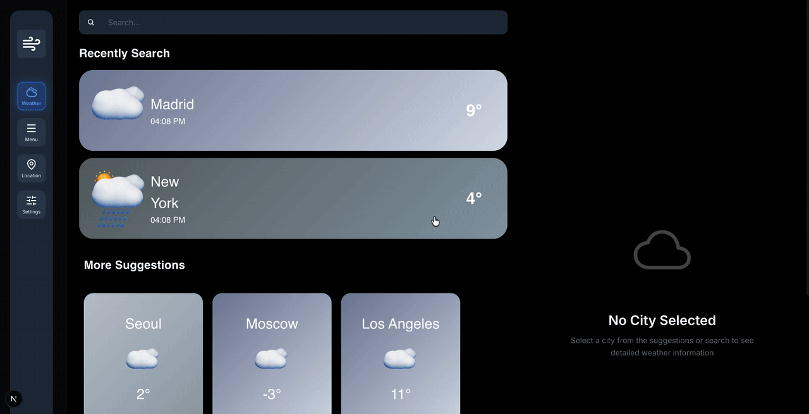
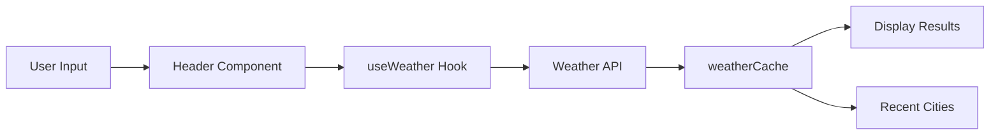

<div align="center">

# 🌦️ Weather Dashboard

### Modern Weather Application Built with Next.js & TypeScript

[](https://nextjs.org/)
[](https://www.typescriptlang.org/)
[](https://react.dev/)
[](https://zustand-demo.pmnd.rs/)
[](LICENSE)

**A beautiful, responsive weather application featuring real-time data, forecasts, and dynamic UI elements**

[Live Demo](#) · [Report Bug](../../issues) · [Request Feature](../../issues)



</div>

---

## ✨ Features

<table>
<tr>
<td width="50%">

### 🔍 Smart Search
- Instant city weather lookup
- Auto-save search history
- Recent searches quick access

### 🌡️ Real-Time Data
- Current temperature & conditions
- Humidity & wind speed
- Feels-like temperature

### 📊 Detailed Forecasts
- 8-hour detailed predictions
- 7-day weather outlook
- Hour-by-hour breakdown

</td>
<td width="50%">

### 🎨 Dynamic UI
- Weather-based color gradients
- Context-aware icons
- Smooth animations

### ⚡ Performance
- Intelligent caching system
- Optimized API calls
- Lightning-fast responses

### 📱 Responsive Design
- Mobile-first approach
- Tablet & desktop optimized
- Touch-friendly interface

</td>
</tr>
</table>

---

## 🚀 Tech Stack

<div align="center">

| Category | Technology | Purpose |
|----------|-----------|---------|
| **Framework** |  | React framework with SSR |
| **Language** |  | Type-safe development |
| **Styling** |  | Modular CSS with variables |
| **State** |  | Lightweight state management |
| **HTTP** |  | Promise-based HTTP client |
| **API** | OpenWeatherMap | Weather data provider |

</div>

---

## 📸 Screenshots

<details>
<summary>Click to expand</summary>

### Main Dashboard


### City Search


### Weather Details


</details>

---

## 🏗️ Project Structure

```
src/
├── 📂 app/                    # Next.js App Router
│   ├── layout.tsx            # Root layout
│   └── page.tsx              # Home page
│
├── 📂 components/            # React Components
│   ├── 📂 Cards/            # Weather Cards
│   │   ├── DailyForecast/   # 7-day forecast
│   │   ├── HourlyForecast/  # Hourly predictions
│   │   ├── MoreSuggestions/ # City suggestions
│   │   ├── RecentlySearch/  # Search history
│   │   └── WeatherCard/     # Main weather display
│   ├── 📂 Header/           # Search header
│   ├── 📂 LeftSidebar/      # Navigation sidebar
│   ├── 📂 MainContent/      # Main content area
│   ├── 📂 RightSidebar/     # Weather details
│   └── 📂 UI/               # Reusable UI components
│
├── 📂 constants/            # App constants
├── 📂 hooks/                # Custom React hooks
├── 📂 services/             # API services
├── 📂 store/                # Zustand store
├── 📂 styles/               # Global styles
├── 📂 types/                # TypeScript types
└── 📂 utils/                # Utility functions
```

---

## 🚦 Getting Started

### Prerequisites

- Node.js 18.0 or higher
- npm or yarn package manager
- OpenWeatherMap API key ([Get one here](https://openweathermap.org/api))

### Installation

1️⃣ **Clone the repository**
```bash
git clone https://github.com/TamarCoder/Weather-Web-App-Design-Template.git
cd Weather-Web-App-Design-Template
```

2️⃣ **Install dependencies**
```bash
npm install
# or
yarn install
```

3️⃣ **Set up environment variables**

Create a `.env.local` file in the root directory:
```env
NEXT_PUBLIC_OPENWEATHER_API_KEY=your_api_key_here
```

> 💡 **Tip:** Get your free API key from [OpenWeatherMap](https://openweathermap.org/api)

4️⃣ **Start development server**
```bash
npm run dev
# or
yarn dev
```

5️⃣ **Open your browser**

Navigate to [http://localhost:3000](http://localhost:3000) 🎉

---

## 📖 Documentation

Detailed documentation is available for each module:

- 📘 [**Services**](src/services/README.md) - API integration guide
- 📗 [**Hooks**](src/hooks/README.md) - Custom hooks documentation
- 📙 [**Store**](src/store/README.md) - State management guide
- 📕 [**Utils**](src/utils/README.md) - Utility functions
- 📔 [**Constants**](src/constants/README.md) - App constants

---

## 🔄 How It Works

### City Search Flow


### Architecture Overview

1. **User searches** for a city in the Header component
2. **useWeather hook** fetches data from OpenWeatherMap API
3. **Data is cached** in Zustand store to prevent redundant API calls
4. **City is added** to recent searches (max 5)
5. **Components auto-update** with new weather data

---

## 🎯 Key Features Explained

### Weather Caching System
- Stores weather data locally to reduce API calls
- Improves app performance and user experience
- Automatic cache management

### Dynamic Icons & Gradients
- Weather icons change based on conditions and temperature
- Background gradients adapt to current weather
- Smooth transitions between states

### Smart Suggestions
- Random selection of 3 cities on each page load
- Pre-fetches weather data for instant display
- Showcases weather around the world

---

## 🛠️ Available Scripts

| Command | Description |
|---------|-------------|
| `npm run dev` | Start development server |
| `npm run build` | Build for production |
| `npm run start` | Start production server |
| `npm run lint` | Run ESLint |

---

## 🌟 API Integration

This app uses the [OpenWeatherMap API](https://openweathermap.org/api) to fetch:

- **Current Weather** - Real-time conditions for any city
- **5-Day Forecast** - 3-hour interval predictions
- **Weather Icons** - Condition-specific imagery

### API Endpoints Used

```typescript
// Current weather
GET /weather?q={city}&appid={API_KEY}&units=metric

// 5-day forecast
GET /forecast?q={city}&appid={API_KEY}&units=metric

// Coordinates-based weather
GET /weather?lat={lat}&lon={lon}&appid={API_KEY}&units=metric
```

---

## 🎨 Customization

### Adding New Weather Icons

1. Add icon file to `public/images/`
2. Update `src/utils/weatherIcons.ts`:

```typescript
export const getWeatherIcon = (weatherMain: string, temp: number) => {
  // Add your custom logic
  return '/images/your-icon.png';
};
```

### Changing Color Gradients

Edit gradients in `src/utils/weatherIcons.ts`:

```typescript
export const getWeatherGradient = (weatherMain: string, temp: number) => {
  return 'linear-gradient(135deg, #yourcolor1 0%, #yourcolor2 100%)';
};
```

---

## 🐛 Known Issues

- [ ] Forecast data updates every 3 hours (API limitation)
- [ ] Some cities may have multiple matches (use specific names)

---

## 🗺️ Roadmap

- [ ] **localStorage** - Persist recent searches
- [ ] **Geolocation** - Auto-detect user's location
- [ ] **Dark/Light Mode** - Theme toggle
- [ ] **Weather Alerts** - Severe weather notifications
- [ ] **Multiple Languages** - i18n support
- [ ] **PWA Support** - Offline functionality
- [ ] **Unit Tests** - Comprehensive test coverage
- [ ] **Animations** - Enhanced UI transitions

---

## 🤝 Contributing

Contributions are welcome! Please follow these steps:

1. Fork the repository
2. Create your feature branch (`git checkout -b feature/AmazingFeature`)
3. Commit your changes (`git commit -m 'Add some AmazingFeature'`)
4. Push to the branch (`git push origin feature/AmazingFeature`)
5. Open a Pull Request

---

## 📝 License

This project is licensed under the MIT License - see the [LICENSE](LICENSE) file for details.

---

## 👨‍💻 Author

**Tamar Khuskivadze**

- GitHub: [@TamarCoder](https://github.com/TamarCoder)
- Email: [your.email@example.com](mailto:your.email@example.com)

---

## 🙏 Acknowledgments

- [OpenWeatherMap](https://openweathermap.org/) for the weather API
- [Next.js](https://nextjs.org/) team for the amazing framework
- [Zustand](https://zustand-demo.pmnd.rs/) for simple state management
- [Lucide Icons](https://lucide.dev/) for beautiful icons

---

<div align="center">

### ⭐ Star this repo if you found it helpful!

Made with ❤️ by [Tamar Khuskivadze](https://github.com/TamarCoder)

[Back to Top ⬆️](#-weather-dashboard)

</div>
